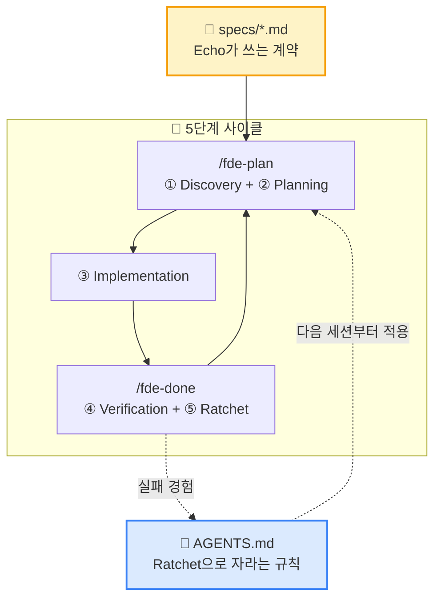

# FDE Harness — Claude Code & Codex Dual Plugin

Forward Deployed Engineer 방법론을 AI 코딩 에이전트의 작업 흐름으로 구현한 최소 하네스 플러그인입니다. **Claude Code와 OpenAI Codex 양쪽에서 동일하게 작동**합니다.

## 무엇을 하는가

- `specs/` 폴더에 사람이 작성한 명세를 AI 에이전트가 읽고 코드로 변환합니다
- 구현 전 계획 보고와 인간 승인 게이트를 강제합니다
- 실패 패턴을 `AGENTS.md`의 "절대 하지 말 것" 섹션에 누적시켜 같은 실수를 반복하지 않게 합니다 (Ratchet 원리)

## 개념 한 장 요약



### 이 다이어그램을 구성하는 4가지 최소 개념

1. **Echo / Delta 분리** — 사용자가 Echo(도메인 전문가), AI가 Delta(구현자). 누가 무엇을 아는지를 분리한다.
2. **Spec = 계약** — Echo가 쓰는 `specs/*.md`. Why · What · Done means · Out of scope 4슬롯.
3. **승인 게이트** — `/fde-plan` 이 **코드 작성 전 Echo의 명시적 합의** 를 강제한다.
4. **Ratchet** — 실패 → 한 줄 규칙 → `AGENTS.md`. **한 방향으로만 자란다** (제거 금지).

> 4가지 중 하나라도 빠지면 방법론이 작동하지 않습니다.
> - 두 역할의 책임 상세 → `/fde-init` 후 생성되는 `AGENTS.md` 의 `## 두 역할` 섹션
> - 개념도 전체 (5단계 사이클·Ratchet·컴포넌트 매핑·설계 근거) → **[docs/concepts.md](docs/concepts.md)**

## 포함된 컴포넌트

- **1 Skill** (`skills/fde-workflow/`): 워크플로우 5단계 (Discovery → Plan → Implement → Verify → Ratchet)
- **4 Slash Commands**:
  - `/fde-init` — 새 프로젝트에 FDE 폴더 구조 초기화
  - `/fde-spec <제목>` — 새 spec 파일을 템플릿으로 생성
  - `/fde-plan` — 다음 spec의 구현 계획 보고 (코드 작성 없음)
  - `/fde-done` — 검증 후 완료 처리 및 Ratchet 학습
- **2 Templates** (`templates/`): spec 템플릿, AGENTS.md 템플릿
- **MCP Servers** (`.mcp.json`): filesystem, git (최소 구성)

## 설치 방법

### Claude Code

```bash
# 방법 1: 마켓플레이스를 통한 설치 (이 리포지토리가 GitHub에 있을 경우)
/plugin marketplace add SeokRae/fde-harness
/plugin install fde-harness

# 방법 2: 로컬 설치
git clone https://github.com/SeokRae/fde-harness ~/.claude/plugins/fde-harness
# Claude Code 재시작
```

### Codex

```bash
# 로컬 마켓플레이스에 등록
mkdir -p ~/.agents/plugins
cp -r ./fde-harness ~/.agents/plugins/
# ~/.agents/plugins/marketplace.json 에 항목 추가
codex plugin marketplace add ~/.agents/plugins
```

또는 `~/.codex/config.toml` 에 직접 추가:

```toml
[[plugins]]
name = "fde-harness"
path = "/path/to/fde-harness"
enabled = true
```

## 사용 흐름 (양쪽 동일)

```
1. 프로젝트 루트에서 /fde-init 실행
   → specs/, .harness/, AGENTS.md 생성

2. AGENTS.md를 프로젝트 도메인에 맞게 수정 (도메인 용어, 코딩 규칙 등)

3. /fde-spec 로그인 기능 실행
   → specs/001-로그인-기능.md 생성

4. spec 파일의 What/Why/Done means 채우기

5. /fde-plan 실행
   → AI가 구현 계획 보고, 사용자 승인 대기

6. "진행해" 응답
   → AI가 계획대로만 구현

7. /fde-done 실행
   → Done means 체크리스트 검증, 통과 시 done.log 기록
   → 실패 경험이 있었다면 AGENTS.md에 Ratchet 규칙 추가
```

## 폴더 구조

```
fde-harness/
├── .claude-plugin/plugin.json    # Claude Code manifest
├── .codex-plugin/plugin.json     # Codex manifest
├── .mcp.json                     # MCP 서버 설정
├── marketplace.json              # 로컬 마켓플레이스 정의
├── skills/
│   └── fde-workflow/SKILL.md     # 공유 Agent Skill (양쪽 표준)
├── commands/                     # Claude Code 슬래시 커맨드
│   ├── fde-init.md
│   ├── fde-spec.md
│   ├── fde-plan.md
│   └── fde-done.md
├── templates/
│   ├── spec-template.md          # 사용자 프로젝트로 복사할 spec 템플릿
│   └── AGENTS.md                 # 사용자 프로젝트로 복사할 AGENTS 템플릿
├── docs/
│   └── concepts.md               # FDE 방법론 개념도 (Mermaid)
├── AGENTS.md                     # 이 레포 자체의 기여자용 지침
├── LICENSE
└── README.md
```

## 다음으로 추가할 만한 것 (트리거 기준)

이 MVP는 의도적으로 최소화되어 있습니다. 다음 증상이 보일 때 해당 컴포넌트를 추가하세요.

| 증상 | 추가할 것 |
|------|----------|
| AI가 도메인 지식을 잘못 추측 | Ontology 모듈 (skills/ontology-builder/) |
| 같은 실수를 다른 형태로 반복 | 장기 메모리 시스템 |
| Done means 체크가 너무 부담 | 자동 Eval harness (hooks/post-tool-use.json) |
| 위험한 명령 시도 | Guardrail hooks (hooks/permission-request.json) |
| 한 spec이 너무 큰 작업 | Planner/Coder 서브에이전트 분리 (agents/) |

## 라이선스

MIT — 자유롭게 fork해서 본인 팀 도메인에 맞게 수정하세요.
