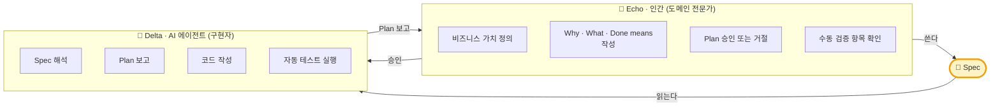
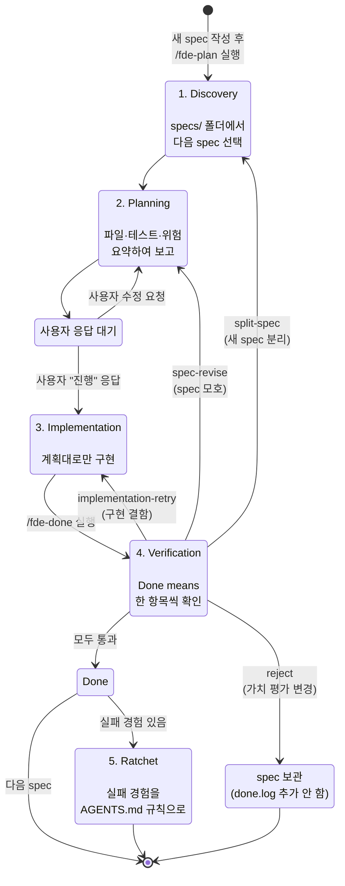
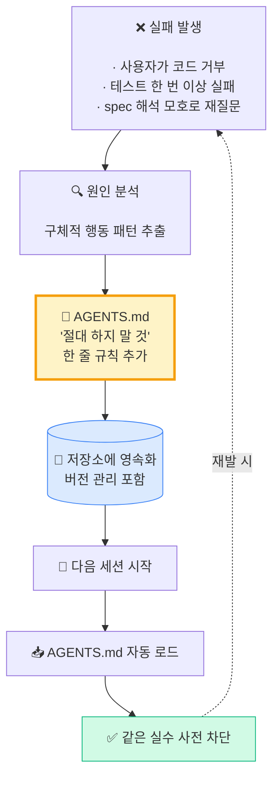
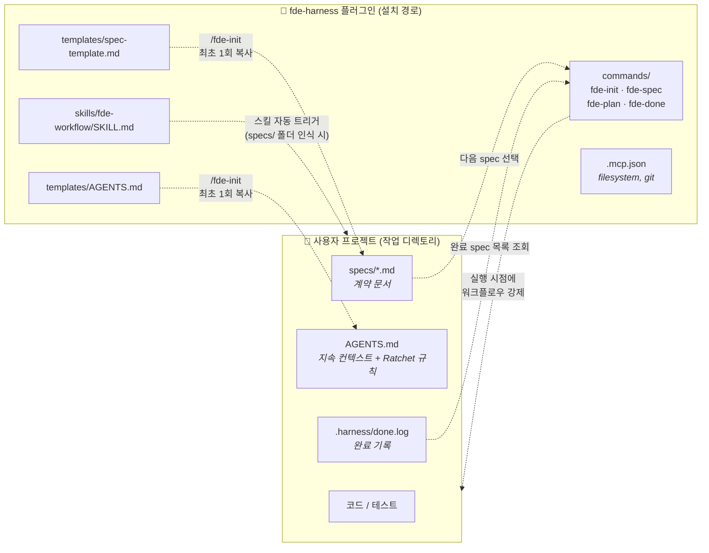
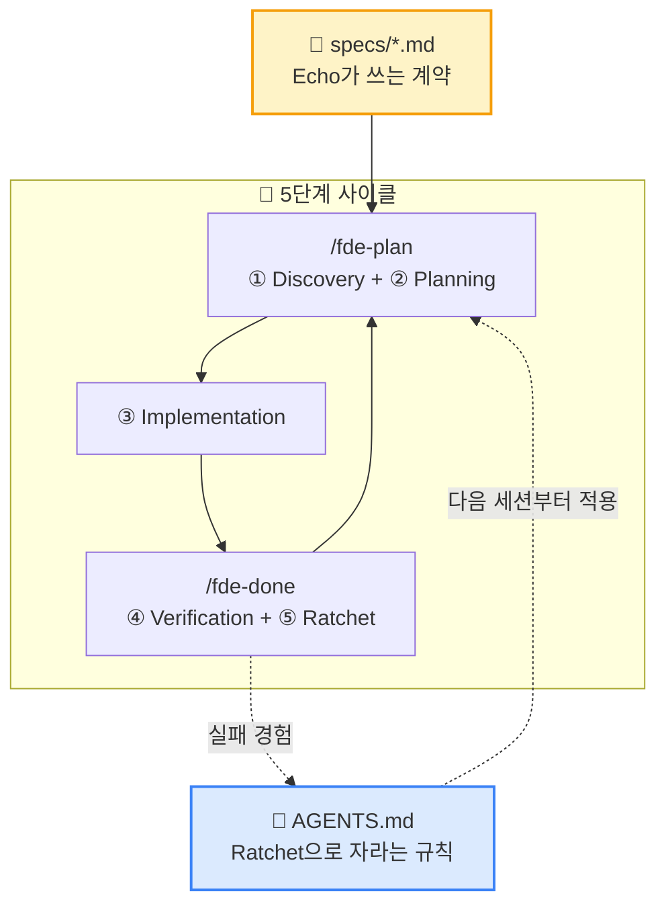

# FDE 방법론 — 개념도

이 문서는 **Forward Deployed Engineer** 방법론이 `fde-harness` 플러그인 안에서 어떻게 강제되는지를 시각적으로 설명합니다.

> 💡 텍스트 설명은 [README](../README.md) 와 [SKILL.md](../skills/fde-workflow/SKILL.md) 에 있습니다. 이 문서는 **"왜 이런 구조인가"** 를 한눈에 파악하기 위한 다이어그램 모음입니다.

---

## 1. 두 역할 — Echo와 Delta, 그리고 그 사이의 Spec

FDE는 두 인물 모델을 전제로 합니다. 도구는 이 분리를 강제하기 위한 장치입니다.

**Spec은 둘 사이의 계약입니다.**
- Echo는 Spec에 없는 산출물을 기대하지 않습니다.
- Delta는 Spec에 없는 코드를 만들지 않습니다.
- 모호한 부분은 Spec의 `Open questions` 로 명시 — 구현 시작 전에 해결.

---

## 2. 5단계 작업 사이클

### 각 단계 책임

| 단계 | 주체 | 산출물 | 슬래시 커맨드 |
|------|------|--------|---------------|
| 1. Discovery | Delta | 다음 작업할 spec ID + 한 줄 요약 | `/fde-plan` (인자 없음 시) |
| 2. Planning | Delta | Plan 문서 (수정 파일·테스트·위험·불명확 점) | `/fde-plan` |
| 3. Implementation | Delta | 코드 변경 (계획 범위 내) | (커맨드 없음, 일반 코드 작성) |
| 4. Verification | Echo + Delta | Done means 체크 결과 | `/fde-done` |
| 5. Ratchet | Echo | `AGENTS.md` 의 새 규칙 한 줄 | `/fde-done` 후속 질문 |

---

## 3. Ratchet 원리 — 실패의 일방향 누적

Ratchet(톱니바퀴)은 **한 방향으로만 돈다**. FDE의 학습 누적도 같은 원리입니다.

### 규칙 작성 원칙

| 좋은 규칙 (구체적) | 나쁜 규칙 (모호) |
|------------------|----------------|
| ✅ 데이터베이스 마이그레이션은 항상 backward-compatible 해야 한다 | ❌ 주의 깊게 작업하라 |
| ✅ `.env` 파일을 커밋하지 않는다 | ❌ 보안에 신경 써라 |
| ✅ Stripe API 호출 시 idempotency key 를 항상 포함한다 | ❌ 외부 API 호출에 주의 |

### 왜 "삭제 금지" 인가

- 규칙은 **누군가 실제로 실수했던 흔적**이다. 흔적을 지우면 흔적이 보호하는 미래의 자기 자신이 사라진다.
- 규칙이 더 이상 의미 없어 보인다면 **삭제가 아니라 재설계** — 더 일반적인 규칙으로 압축하거나, 도구로 강제(예: lint 룰, CI 체크)하는 방향으로 승격.

---

## 4. 컴포넌트 매핑 — 플러그인과 사용자 프로젝트

**역할 분담**:
- **플러그인** = 워크플로우 강제 + 템플릿 제공 (재사용 자산)
- **사용자 프로젝트** = 계약(specs) + 학습 데이터(AGENTS.md) + 코드 (프로젝트별 고유 자산)

---

## 5. 왜 이런 구조인가 (설계 근거)

각 FDE 원칙이 도구의 어떤 부분에서 강제되는지 매핑한 표입니다.

| 원칙 | 강제 메커니즘 (어디서) |
|------|----------------------|
| **Spec이 단일 진실 공급원** | `/fde-plan` 이 `Out of scope` 섹션을 사전에 확인하고 위반 가능성을 경고 |
| **인간 승인 게이트** | `/fde-plan` 본문 4번 규칙: *"이 명령에서는 절대 실제 코드 파일을 수정하거나 생성하지 않는다"* |
| **계획대로만 구현** | `SKILL.md` 3단계: *"계획에 없는 파일을 수정하게 되면 즉시 멈추고 계획을 갱신해 다시 승인받는다"* |
| **완료 객관성** | Done means 체크리스트의 모든 항목 통과 시에만 `.harness/done.log` 기록 (`/fde-done` 4번 단계) |
| **학습 누적성** | `/fde-done` 5번 단계: 실패 경험 발생 여부 질문 → `AGENTS.md` "절대 하지 말 것" 섹션에 추가 |
| **재실수 방지** | 세션 시작 시 Claude Code/Codex 가 `AGENTS.md` 를 자동 로드 → 모든 응답이 규칙 위에서 생성 |

---

## 6. 한 장 요약

> Spec은 **각 작업의 계약**, AGENTS.md는 **프로젝트 전체의 누적된 학습**.
> 이 두 문서 위에서 AI 에이전트가 일관되게 작동하도록 강제하는 것이 fde-harness의 전부입니다.

---

## 참고

- 슬래시 커맨드 본문: [`commands/`](../commands/)
- 스킬 정의: [`skills/fde-workflow/SKILL.md`](../skills/fde-workflow/SKILL.md)
- 템플릿: [`templates/`](../templates/)
- 메인 README: [`../README.md`](../README.md)
