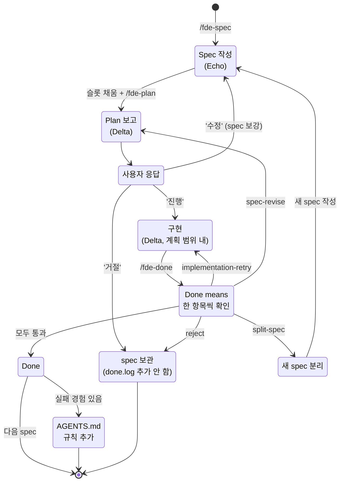
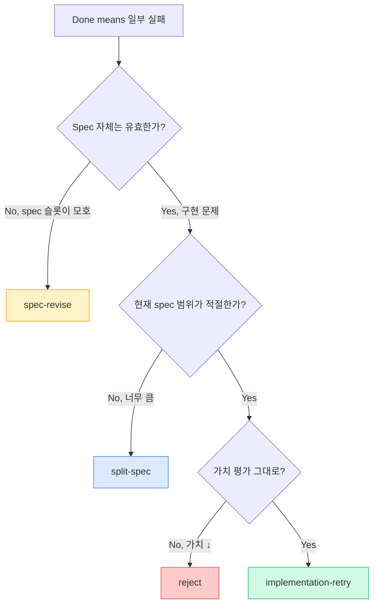

# FDE 사이클 가이드 — 한 사이클을 처음부터 끝까지

이 문서는 **하나의 spec이 작성되고 완료될 때까지의 전 과정**을 단일 페이지에서 추적할 수 있도록 만든 walkthrough 입니다.

- 개념 다이어그램은 → [`docs/concepts.md`](concepts.md)
- 각 슬래시 커맨드 본문은 → [`../commands/`](../commands/)
- Echo/Delta 역할 책임 상세는 → 사용자 프로젝트의 `AGENTS.md` 의 `## 두 역할` 섹션

> **이 문서는 SSoT** — 사이클 흐름·결정 트리·로그 포맷은 **여기 한 곳에서만** 정의한다. 다른 문서가 사이클 흐름을 언급할 때는 이 문서로 링크한다.

---

## 1. 사이클 한눈에



핵심 전환점 3개:
1. **Approval** — Echo가 Plan을 평가하는 첫 게이트 (코드 작성 전)
2. **Verification 분기** — Done means 결과에 따라 5개 후속 경로
3. **Ratchet** — Done 이후 학습 누적 (옵션이지만 사이클의 가치 핵심)

---

## 2. 워크스루 — `specs/001` 실제 사례

이 레포의 첫 FDE 사이클(PR #12) 을 단계별로 추적합니다.

### Stage 1. Discovery + Spec 작성 (Echo)

**입력**: 직전 audit 결과 — *"검증 실패 분기 부재 (1순위 누수), failure-log 부재 (2순위)"*

**프로세스**:
- Echo가 `specs/` 폴더의 다음 ID 결정 (001 — 첫 spec)
- 파일명 결정: `specs/001-verification-failure-handling.md`
- 4개 필수 슬롯 + 4개 보조 슬롯 채우기

**산출물** ([`specs/001-...`](../specs/001-verification-failure-handling.md)):

| 슬롯 | 한 줄 요약 |
|------|---------|
| Why | 사이클이 한 곳에서 비공식적으로 열려있음, Ratchet 입력이 사람 기억에만 의존 |
| What | `/fde-done` 실패 시 4가지 분기 + `.harness/failure-log` 영속화 |
| Done means | 7개 검증 가능 항목 |
| Out of scope | Hard enforcement / 자동 테스트 hook / 메타데이터 통계 |

### Stage 2. Plan 보고 (Delta)

**입력**: `specs/001` + 트리거 (사용자가 `/fde-plan` 호출)

**프로세스**:
- Delta가 spec 전체를 읽고 5개 항목으로 plan 보고
- **이 단계에서 코드는 한 줄도 만지지 않음** ([`commands/fde-plan.md`](../commands/fde-plan.md) 4번 규칙)

**산출물** (Plan 보고):
- 수정/생성 파일: 5개 (commands/fde-done.md, fde-init.md, templates/AGENTS.md, skills/fde-workflow/SKILL.md, specs/001 신규)
- 테스트 케이스: 수동 점검 항목 3개
- 예상 위험: 본문 길이 ↑, failure-log 포맷 마이그레이션
- 불명확한 점: 없음 (`Open questions` 의 JSON Lines 검토는 P2)

### Stage 3. Approval — Echo의 응답

**입력**: Plan 보고

**결정**: "진행" (코드 작성 시작)

> Echo가 "수정 요청" 응답 시 → Stage 1로 회귀하여 spec 보강
> Echo가 "거절" 응답 시 → spec을 cancelled 로 마킹, done.log 추가 안 함

### Stage 4. Implementation (Delta)

**입력**: 승인된 Plan

**프로세스**:
- 5개 파일을 계획 범위 내에서 수정/생성
- 계획에 없는 파일을 만지게 되면 즉시 멈추고 Plan 갱신 (이번 사이클에서는 발생 안 함)
- 매 Edit 후 PostToolUse hook 동작 (PR #14 도입 — 이 레포에는 `./test.sh` 없으므로 no-op)

**산출물**: 6 files 변경 + 1 신규 (`specs/001`)

### Stage 5. Verification (Delta + Echo)

**입력**: 구현된 코드

**프로세스**: `/fde-done` 호출, Done means 7항목을 한 줄씩 점검

**결과**: 7/7 통과 → `.harness/done.log` 에 기록 → Stage 6으로

> 부분 실패였다면 → § 4.2 "Verification 4가지 분기" 결정 트리로 이동

### Stage 6. Ratchet (Echo)

**입력**: 사이클 진행 중 모든 마찰

**프로세스**:
- "이번에 같은 실수 반복 안 하려면?" 자체 질문
- 1건 발견: *"워크플로우 동사를 변경할 때 4곳을 모두 동기화해야 한다"*

**산출물**: 루트 `AGENTS.md` `## 절대 하지 말 것` 에 한 줄 추가

> 이 규칙은 그 다음 사이클(specs/002)의 자체 체크 항목이 됨. → **Ratchet이 실제로 작동했다는 증거**.

---

## 3. 단계별 산출물 매트릭스

| 단계 | 입력 | 산출물 | 위치 | 작성자 |
|------|------|--------|------|--------|
| 1. Spec 작성 | 도메인 요구·audit 결과 | `specs/{ID}-{kebab}.md` | `specs/` | Echo |
| 2. Plan 보고 | spec | 5항목 plan (텍스트) | 채팅 또는 PR description | Delta |
| 3. Approval | plan | "진행 / 수정 / 거절" 응답 | 채팅 | Echo |
| 4. Implementation | 승인된 plan | 코드·문서·테스트 변경 | 프로젝트 코드 | Delta |
| 5. Verification | Done means + 구현 | 통과/실패 + 결정 | `.harness/done.log` 또는 `.harness/failure-log` | Delta + Echo |
| 6. Ratchet | 사이클 마찰 | 새 한 줄 규칙 | `AGENTS.md` `## 절대 하지 말 것` | Echo |

---

## 4. 결정 트리

### 4.1 Echo의 Plan 평가 (Stage 3)

| 응답 | 트리거 | 다음 단계 |
|------|--------|---------|
| **진행** | Plan이 spec과 일치, 위험 합리적, 누락 없음 | Stage 4 (Implementation) |
| **수정 (plan-revise)** | Plan에 파일·테스트 누락, 위험 누락, Out of scope 침범 | Delta가 Plan 다시 보고 (spec 변경 없이) |
| **수정 (spec-revise)** | Plan 보고를 통해 spec의 슬롯이 모호하다는 점 발견 | Stage 1 회귀 (spec 보강) |
| **거절** | 가치 평가 변경, 우선순위 변경 | spec 보관, 다음 spec으로 |

### 4.2 Verification 4가지 분기 (Stage 5 실패 시)

`/fde-done` 에서 Done means 중 하나라도 실패하면 다음 4가지 중 **하나만** 선택:



| Decision | 트리거 (구체적 신호) | 다음 단계 |
|----------|---------------------|---------|
| `implementation-retry` | Done means 항목 1-2개 실패, 명백한 코드 버그 | Stage 4 (Implementation) 재진입 |
| `spec-revise` | Done means 가 모호해서 "통과" 판단 불가능 | Stage 1 (Spec) 회귀 → 다시 `/fde-plan` |
| `split-spec` | 절반 이상 실패 + 미실패 항목과 결합도가 낮음 | 새 spec 생성 + 현재 spec 축소 |
| `reject` | 작업 중 가치 평가가 바뀜 (외부 요인 변경) | spec 보관, `done.log` 추가 안 함 |

**판단 휴리스틱**:
- 같은 spec을 **3번째 retry** 인데 또 실패 → `spec-revise` 의심 (spec 자체 결함 가능)
- 실패한 항목이 **모두 한 도메인** (예: 보안 관련) → `split-spec` 후보 (그 도메인만 분리)
- 일주일 지나서 다시 보면 **왜 필요한지 모르겠음** → `reject`

결정은 `.harness/failure-log` 에 한 줄로 영속화 (§ 5.2 포맷 참조).

---

## 5. 로그 포맷 레퍼런스

### 5.1 `.harness/done.log` — 성공 기록

**포맷**:
```
{ISO 8601 날짜} {Spec ID} {Spec 제목}
```

**예시**:
```
2026-05-20 001 Verification 실패 처리 (분기 + failure-log)
2026-05-20 002 PostToolUse 자동 테스트 hook
```

**생성 시점**: `/fde-done` 의 Done means 모두 통과 시 자동 (`commands/fde-done.md` Stage 5)
**수동 편집 금지**: `templates/AGENTS.md` 의 "절대 하지 말 것" 에 명시

### 5.2 `.harness/failure-log` — 실패·결정 기록

**포맷**:
```
{ISO 8601 datetime UTC} {Spec ID} {decision}: {한 줄 요약}
```

**decision 값** (5종):

| Decision | 의미 |
|----------|------|
| `implementation-retry` | 구현 결함, 같은 spec 재진입 |
| `spec-revise` | spec 모호, spec 수정 후 `/fde-plan` 재실행 |
| `split-spec` | 현재 spec 너무 큼, 일부 분리 |
| `reject` | 가치 평가 변경, 작업 중단 |
| `done` | (참고용) — 실제로는 `done.log` 에 기록되지만 failure-log 에 추적 라인 남길 수 있음 |

**예시**:
```
2026-05-20T14:15:00Z 001 implementation-retry: DB 마이그레이션 down 누락
2026-05-20T15:30:00Z 001 spec-revise: 수동 검증 항목 추가 필요
2026-05-20T16:45:00Z 001 split-spec: 인증 부분을 002로 분리
2026-05-20T17:00:00Z 001 done: 통과
```

**생성 시점**: `/fde-done` 의 Done means 일부 실패 시, Echo 와 분기 합의 후 자동 (`commands/fde-done.md` Stage 4)
**수동 편집 금지**: `templates/AGENTS.md` 의 "절대 하지 말 것" 에 명시
**Ratchet 입력**: 다음 사이클의 Ratchet 단계에서 failure-log 항목을 한 줄 규칙으로 압축할 수 있음

---

## 6. Spec 라이프사이클 — 현재 상태 + 차후 작업

### 현재 (PR #14 시점)

Spec 의 형식적 상태(`status`)는 **없음**. `.harness/done.log` 에 기록 여부로 binary 구분:

| 상태 | 신호 |
|------|------|
| 작성 중 / 진행 중 | `specs/` 에 있고 `done.log` 에 없음 |
| 완료 | `specs/` 에 있고 `done.log` 에 있음 |
| 거절 | `specs/` 에 있고 `failure-log` 마지막 항목이 `reject` |

**한계**:
- "Spec 작성 완료, 착수 가능" (`ready`) 과 "Spec 작성 중" (`draft`) 구분 못함
- `/fde-plan` 의 Discovery 단계에서 비어있는 슬롯이 있는 spec(draft) 이 선택될 위험

### 차후 (specs/004 후보)

Spec 라이프사이클 frontmatter 도입 검토:

```yaml
---
id: 001
status: draft | ready | in-progress | done | cancelled
created: 2026-05-20
---
```

영향 범위:
- `templates/spec-template.md` 에 frontmatter 추가
- `commands/fde-plan.md` Discovery 에 `status: ready` 필터 추가
- `commands/fde-done.md` 가 status 를 `done` 으로 갱신

이 변경은 spec template 호환성 깨질 수 있으므로 **별도 사이클(specs/004) 로 분리**.

---

## 7. 참고

- 개념 다이어그램 6종: [`docs/concepts.md`](concepts.md)
- 슬래시 커맨드 본문: [`commands/`](../commands/)
- 사용자 프로젝트용 템플릿: [`templates/`](../templates/)
- 활성 hook: [`hooks/README.md`](../hooks/README.md)
- 메타-FDE 적용 흔적 (이 레포의 spec들): [`specs/`](../specs/)
